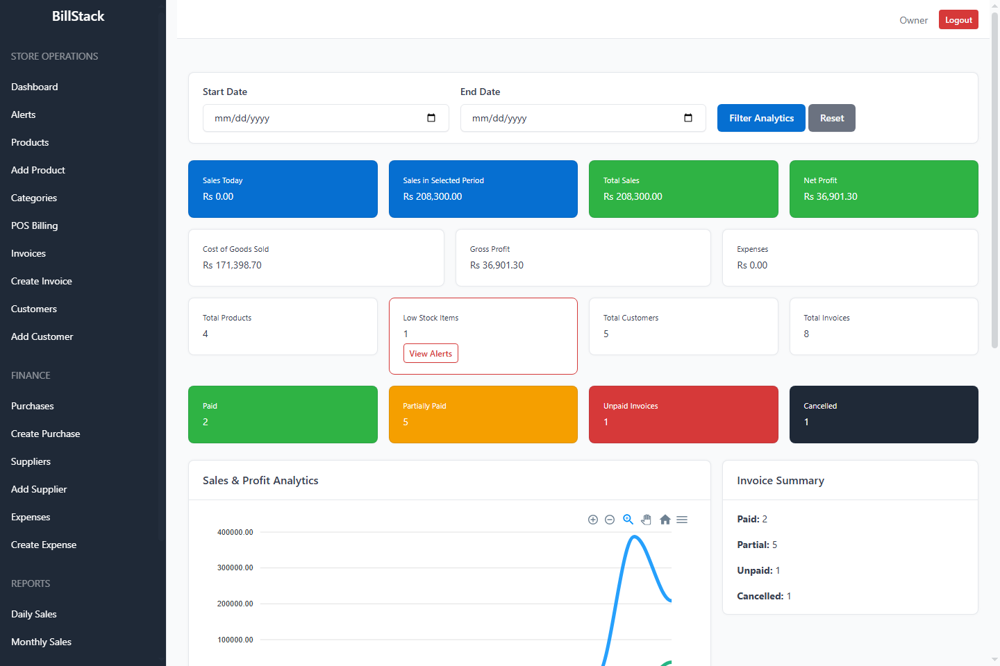
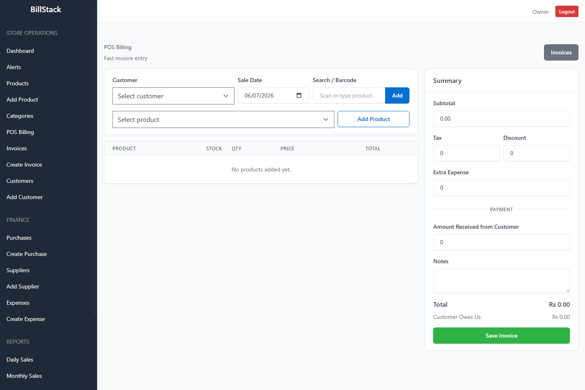
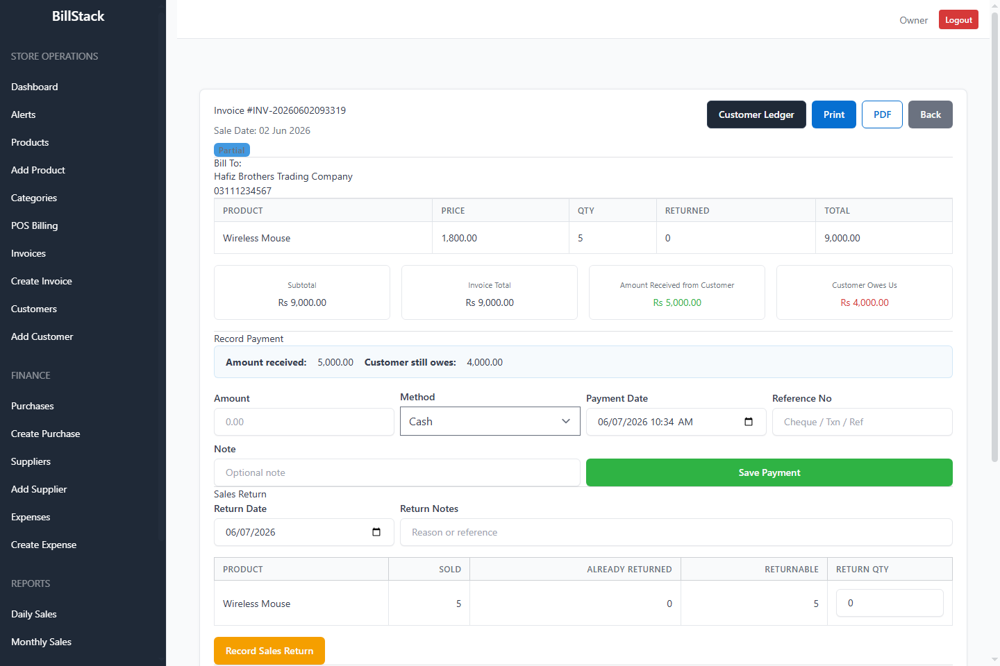
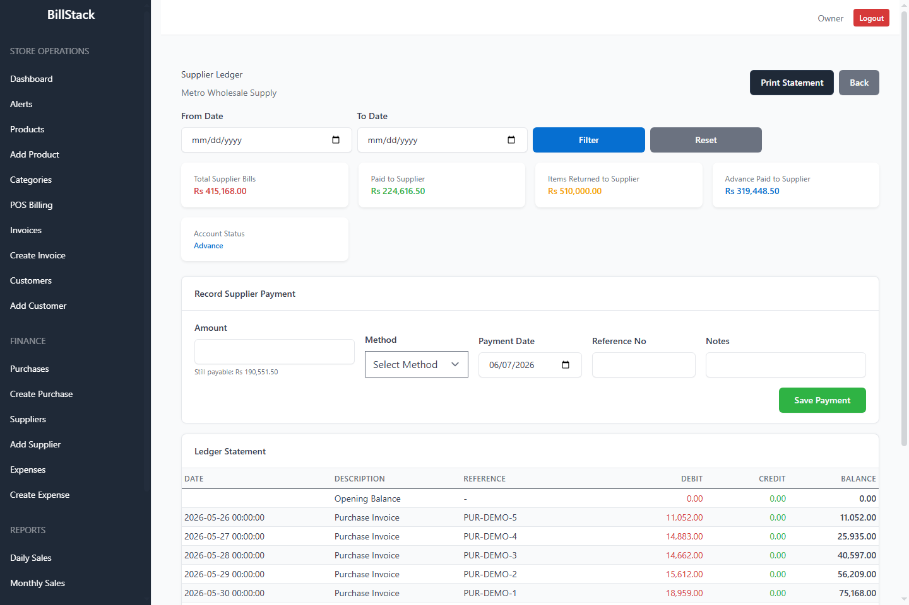

# Zephrant ERP


[](https://github.com/hafizehsanali/zephrant-erp-saas/actions/workflows/ci.yml)
[](https://www.php.net/)
[](https://laravel.com/)
[](LICENSE)

Zephrant ERP is a Laravel-based business management platform for inventory,
billing, customers, reports, and operations.

The public repository contains the generic, demo-safe product foundation.
Client data, deployment secrets, paid modules, and business-specific
customizations remain private.

## Product Preview

| Dashboard | POS Billing |
| --- | --- |
|  |  |

| Invoice Workflow | Supplier Ledger |
| --- | --- |
|  |  |

## Engineering Highlights

- Tenant isolation through global model scopes and tenant-scoped validation
- Transaction-safe stock, payment, return, and cancellation workflows
- Immutable financial history after payments or returns exist
- Stock movement ledger with source references and resulting quantities
- Customer and supplier payment allocation across open documents
- Return credits reflected in inventory and account balances
- Per-tenant invoice and purchase numbering constraints
- Automated coverage across 80 tests and 427 assertions
- CI verification for PHP tests, production assets, and dependency advisories

## Current Features

- Multi-tenant business data separation
- Authentication and role-based access foundation
- Dashboard analytics with sales, profit, expense, invoice, and stock indicators
- Product and category management
- Product stock ledger with sale, purchase, return, and adjustment movements
- Purchase workflow with supplier payments
- Purchase return workflow with supplier ledger credits
- Invoice workflow with customer payments
- POS billing screen
- Sales return workflow with stock restoration
- Customer statements and account payment allocation
- Supplier account ledger and payment allocation
- Expense management
- Alerts Center, currently focused on low-stock alerts
- Sales, stock, low-stock, and profit/loss reports
- Invoice PDF download
- Business settings for invoice branding and company details
- Feature tests for key accounting and inventory flows

See [Architecture](docs/ARCHITECTURE.md) for the design and transaction
boundaries, [Database Schema and Product Import](docs/DATABASE_SCHEMA_AND_PRODUCT_IMPORT.md)
for product/variant import handoff notes, and [Demo Workflows](docs/DEMO_WORKFLOWS.md)
for guided review paths.

Release history is maintained in the [Changelog](CHANGELOG.md). Security
reports should follow the [Security Policy](SECURITY.md).

## Tech Stack

- PHP 8.3+
- Laravel 13
- Laravel Breeze
- Spatie Laravel Permission
- Tabler UI
- Vite
- ApexCharts
- DomPDF
- PHPUnit

## Local Setup

Clone the repository and install dependencies:

```bash
composer install
npm install
```

Create the environment file:

```powershell
Copy-Item .env.example .env
php artisan key:generate
```

Set up the database. SQLite is the simplest local option:

```powershell
New-Item database\database.sqlite -ItemType File -Force
php artisan migrate --seed
```

For MySQL/XAMPP, update `.env` with your database name, username, and password, then run:

```bash
php artisan migrate --seed
```

Create the public storage link used by uploaded business assets:

```bash
php artisan storage:link
```

Build frontend assets:

```bash
npm run build
```

Run the app:

```bash
php artisan serve
```

## Demo Login

Seeded demo users:

- `owner@test.com`
- `alpha@example.com`
- `beta@example.com`

Password for seeded demo users:

- `password`

Use these credentials only for local/demo environments. Never use them in production.

The project currently provides a reproducible local demo rather than a hosted
public environment.

## Verification Commands

Run these before committing major changes:

```bash
php artisan route:list --except-vendor
php artisan view:cache
php artisan test --do-not-cache-result
npm run build
```

For production, set `APP_ENV=production`, `APP_DEBUG=false`, a strong generated
`APP_KEY`, the correct `APP_URL`, and the business timezone in `APP_TIMEZONE`.
Run `php artisan app:production-check` before making a release live. The full
server checklist is in [Production Deployment](docs/DEPLOYMENT.md).

## Public vs Private Usage

Safe for the public repository:

- Generic application source code
- Migrations and demo seeders
- Tests
- Public README and setup notes
- Screenshots using demo data

Keep private:

- `.env` files
- Real customer, supplier, invoice, or financial data
- API keys, mail credentials, payment keys, and server credentials
- Client-specific custom modules
- Production deployment notes
- Paid modules, licensing, or subscription logic

## Commercial Roadmap

Planned business-ready improvements:

- Customer and supplier ageing reports
- Payment reminders in Alerts Center
- Batch/expiry support for pharmacy workflows
- Receipt and statement print polish
- Audit logs for sensitive changes
- Role permission polish per module
- Deployment and onboarding documentation

## License

The generic public foundation is available under the [MIT License](LICENSE).
Private modules, client customizations, production data, and deployment
configuration are not part of this repository.
