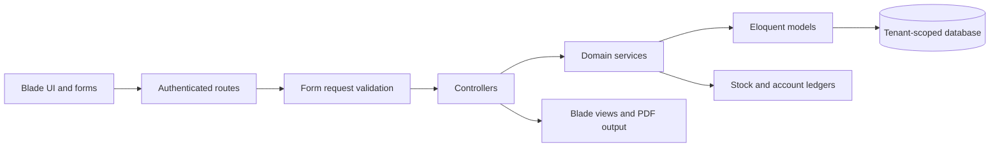
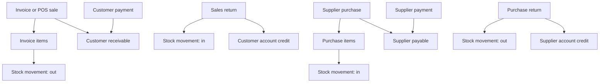

# Zephrant ERP Architecture

Zephrant ERP is a server-rendered Laravel application organized around
tenant-scoped business transactions. Controllers validate requests and
coordinate use cases, services contain accounting and stock rules, Eloquent
models define ownership and relationships, and Blade views provide the
operational interface.

## Application Boundaries

## Tenant Isolation

Business-owned models use the `BelongsToTenant` trait. Its global scope limits
normal application queries to the authenticated user's tenant. Request
validation also scopes referenced suppliers, customers, products, invoices,
and purchases to that tenant.

Tenant ownership is enforced at three levels:

1. Query scopes prevent normal cross-tenant reads.
2. Validation rejects foreign record identifiers.
3. New records copy the authenticated user's `tenant_id`.

Feature tests cover cross-tenant validation and demo-seeder ownership.

## Transaction Model

Invoice and purchase creation, payment updates, returns, cancellation, and
stock mutations run inside database transactions where multiple records must
change together.

## Stock Ledger

`StockLedgerService` records the reason, direction, quantity, unit values,
resulting stock, source record, reference number, and movement date. This
provides an auditable history instead of relying only on the product's current
quantity.

Supported movement sources include purchases, sales, purchase returns, sales
returns, and transaction cancellation.

## Account Ledgers

Customer and supplier balances are calculated from business documents,
payments, and return credits:

- Customer balance: invoice totals minus payments and approved return credits.
- Supplier balance: purchase totals minus supplier payments and purchase
  return credits.

Payment allocation services apply account-level payments to eligible open
documents in a deterministic order and refresh document payment statuses.

## Cancellation Rules

Financial records are preserved rather than deleted after activity occurs.
Only untouched unpaid invoices or purchases can be cancelled. Cancellation
reverses inventory once and records the reversal in the stock ledger.
Transactions with payments or returns remain available as historical records.

## Testing Strategy

The feature suite uses an in-memory SQLite database and covers:

- Tenant isolation and scoped validation
- Invoice and purchase totals
- Customer and supplier payment allocation
- Sales and purchase return accounting
- Stock ledger movements and cancellation reversals
- Deletion safeguards and historical-record protection
- Reports, alerts, forms, landing pages, and demo data integrity

GitHub Actions runs the complete PHP suite, the Vite production build, and
Composer's locked dependency audit on pushes and pull requests.
