# Zephrant ERP Architecture Diagram

## System Overview

Zephrant ERP is a multi-tenant Laravel-based business management SaaS platform for inventory, billing, customer/supplier management, and operations.

## Tech Stack

- **Backend**: PHP 8.3+, Laravel 13, Laravel Breeze, Spatie Laravel Permission
- **Frontend**: Blade templates, TailwindCSS, Alpine.js, Tabler UI, ApexCharts
- **Build Tools**: Vite, PostCSS
- **PDF Generation**: DomPDF
- **Testing**: PHPUnit (80 tests, 427 assertions)
- **Database**: MySQL/SQLite with tenant-scoped data

## High-Level Architecture

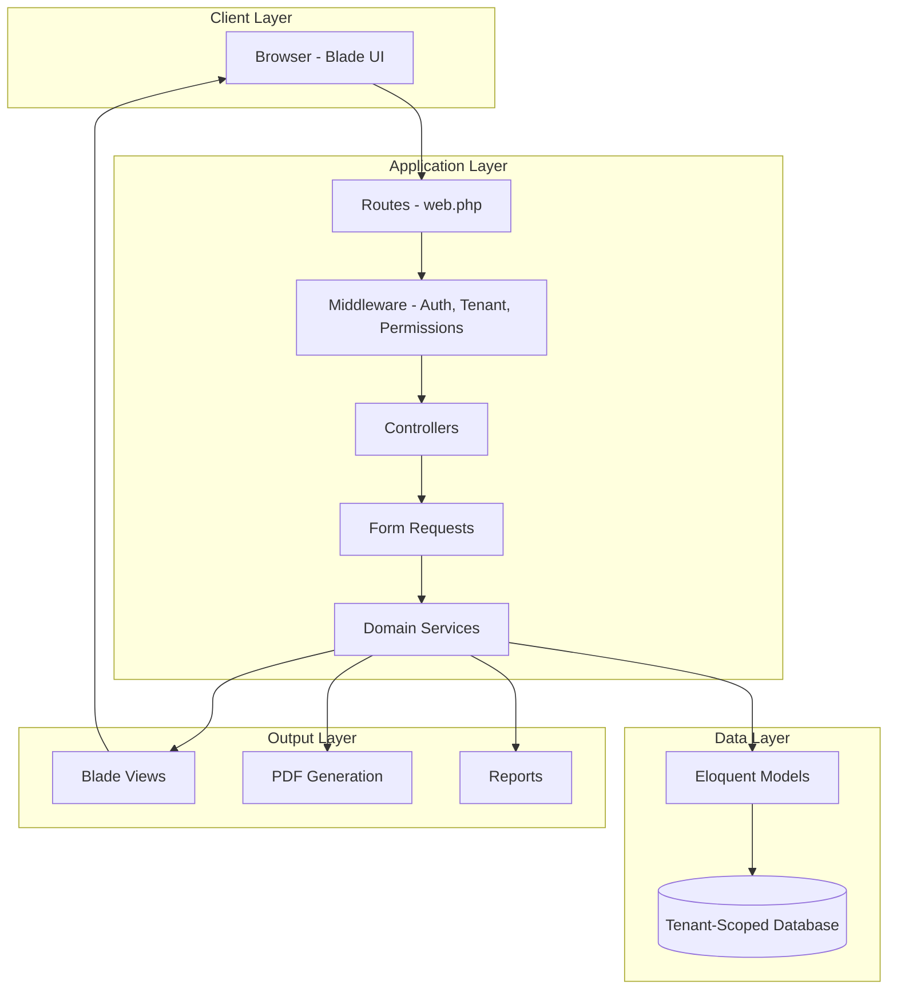

## Multi-Tenant Isolation Architecture

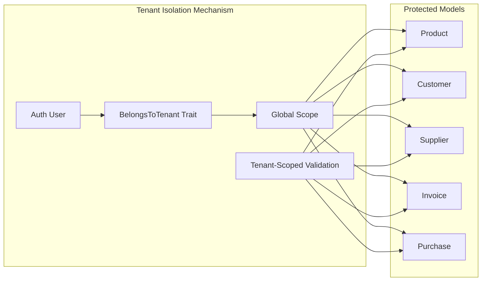

### Tenant Isolation Implementation

The `BelongsToTenant` trait enforces data isolation at three levels:

1. **Query Scope**: Global scope automatically filters all queries by `tenant_id`
2. **Auto-Assignment**: Automatically assigns `tenant_id` on record creation
3. **Validation**: Form requests validate that referenced records belong to the same tenant

## Core Business Modules

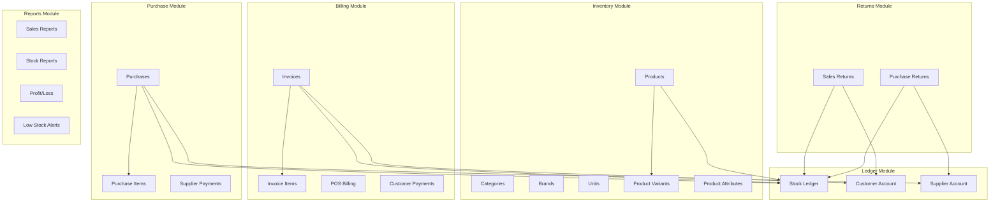

## Sales Transaction Flow

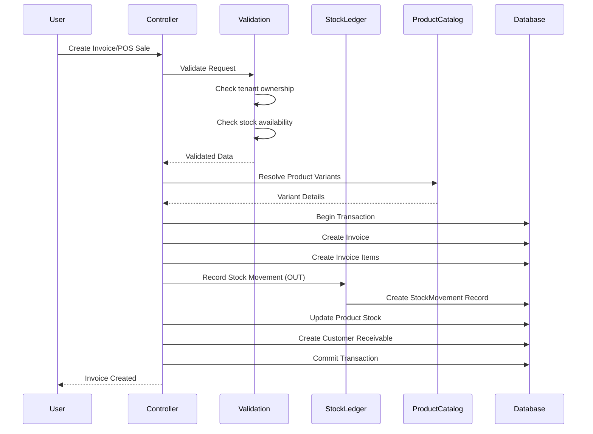

## Purchase Transaction Flow

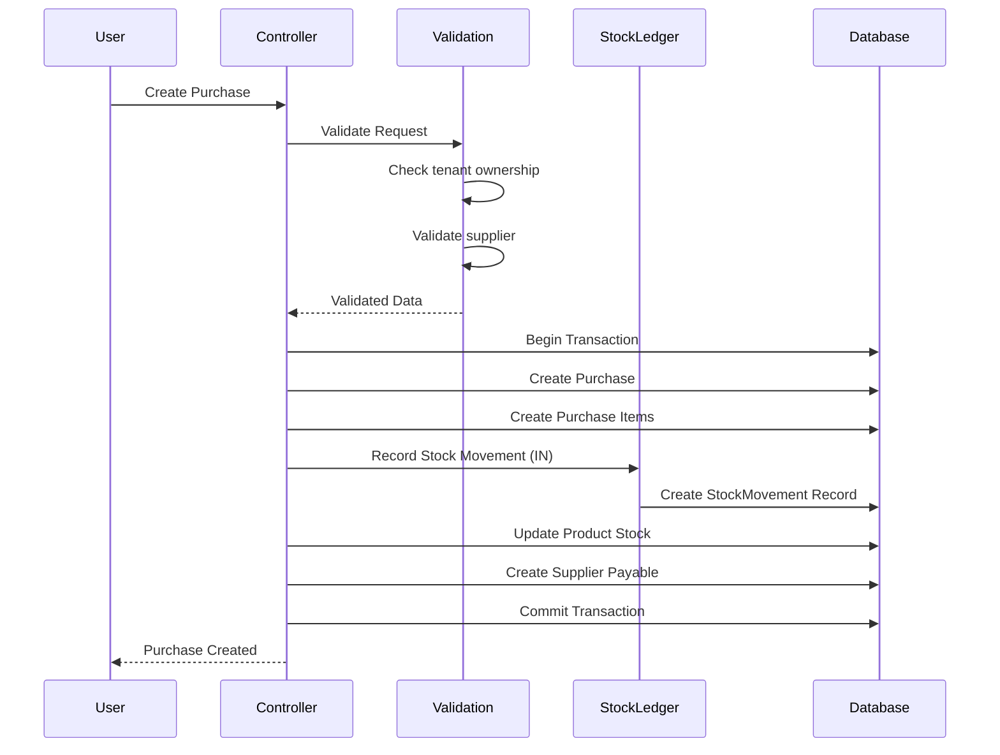

## Payment Allocation Flow

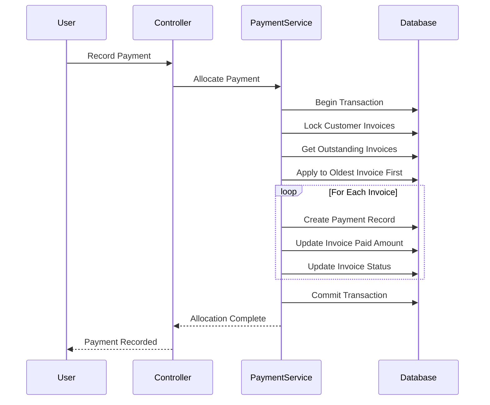

## Stock Ledger System

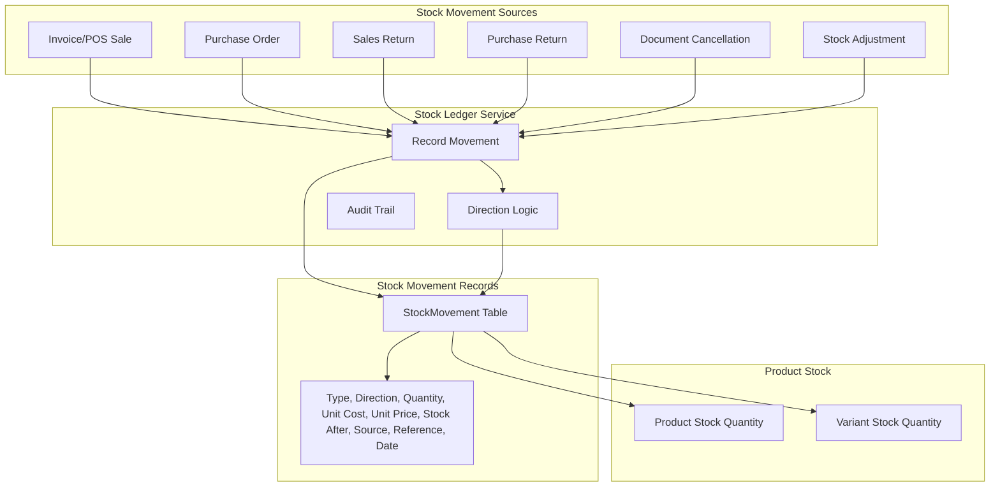

### Stock Movement Types

- **sale**: Stock OUT (invoice/POS sale)
- **purchase**: Stock IN (supplier purchase)
- **sales_return**: Stock IN (customer return)
- **purchase_return**: Stock OUT (supplier return)
- **purchase_cancel**: Stock OUT (purchase cancellation)
- **stock_adjustment_out**: Stock OUT (manual adjustment)
- **stock_adjustment_in**: Stock IN (manual adjustment)

## Account Ledger System

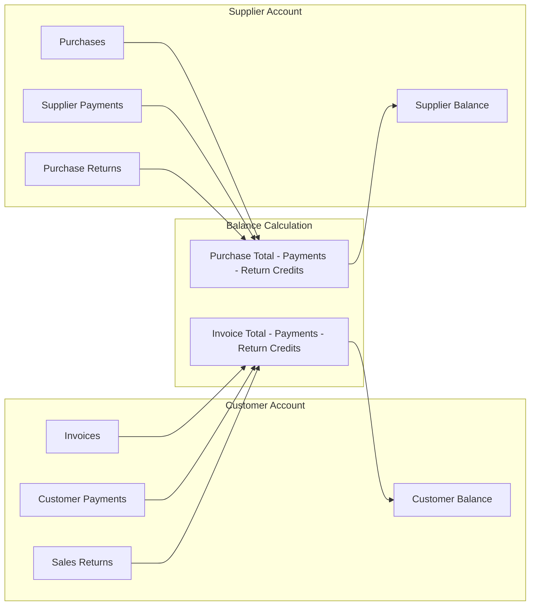

## Controller-Service-Model Pattern

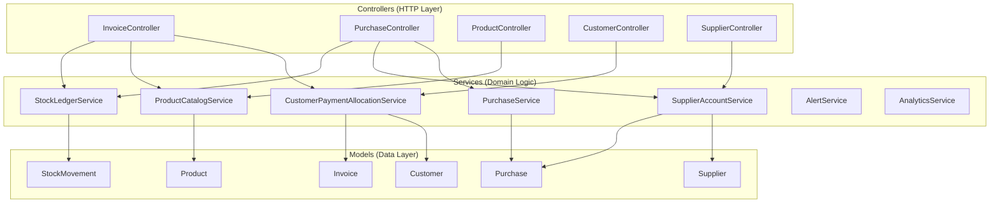

## Subscription & Platform Architecture

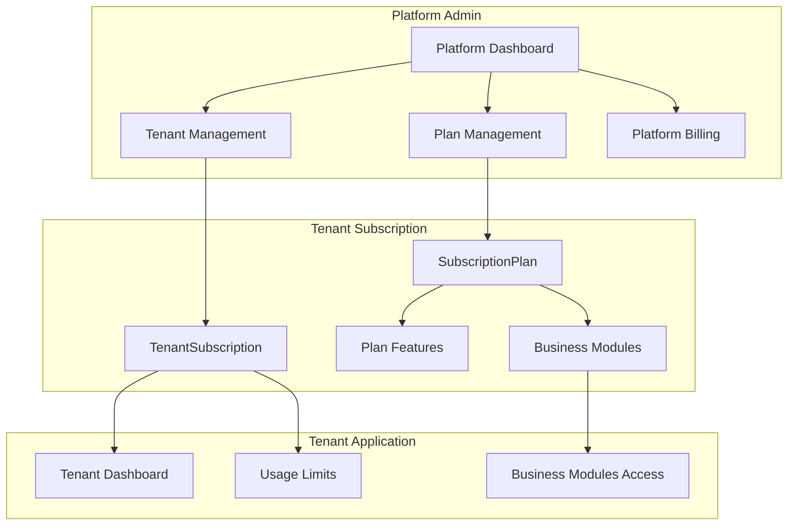

## Middleware Stack

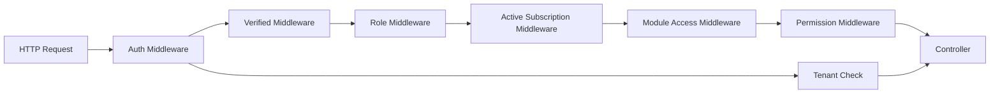

## Database Schema Overview

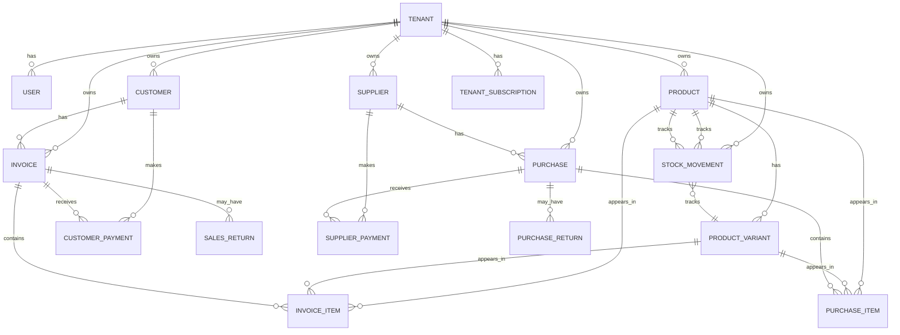

## Key Services & Responsibilities

| Service | Responsibility |
|---------|---------------|
| **StockLedgerService** | Records all stock movements with audit trail |
| **ProductCatalogService** | Resolves product variants, manages catalog logic |
| **CustomerPaymentAllocationService** | Allocates payments to invoices (FIFO) |
| **SupplierAccountService** | Manages supplier ledger and balance calculations |
| **PurchaseService** | Handles purchase workflow and stock updates |
| **AlertService** | Generates low-stock and operational alerts |
| **AnalyticsService** | Calculates dashboard metrics and KPIs |
| **TenantSubscriptionService** | Manages subscription lifecycle |
| **PlatformBillingService** | Handles platform-wide billing |
| **TenantUsageLimitService** | Enforces per-tenant usage limits |

## Transaction Safety

All critical business operations run within database transactions:

- Invoice creation (stock deduction, receivable creation)
- Purchase creation (stock addition, payable creation)
- Payment allocation (multiple invoice updates)
- Returns processing (stock restoration, account credits)
- Cancellations (stock reversal, status updates)

## Cancellation Rules

Financial records are preserved after activity:

- Only unpaid invoices/purchases can be cancelled
- Cancellation reverses inventory once
- Transactions with payments/returns remain as historical records
- Stock ledger records the reversal
- Account balances reflect the cancellation

## Testing Strategy

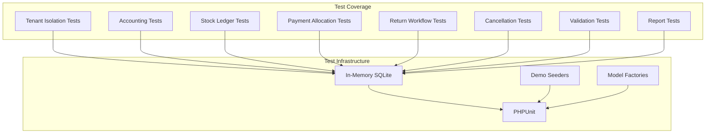

## Feature Flags & Module System

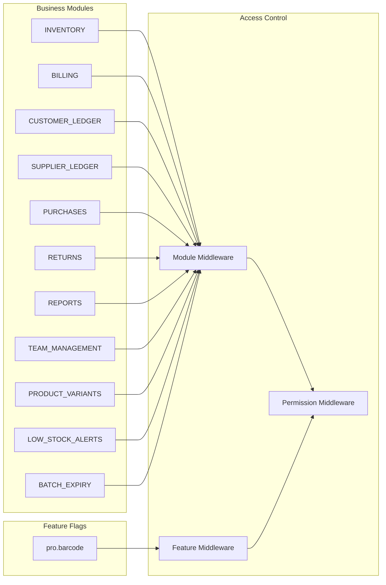

## Deployment Architecture

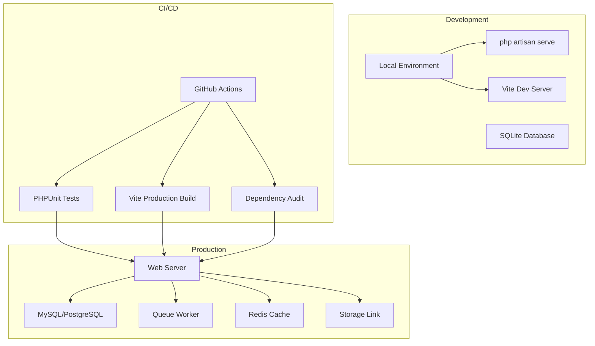

## Security Architecture

```mermaid
graph LR
    subgraph "Authentication"
        LaravelBreeze[Laravel Breeze]
        Session[Session Based Auth]
        Verification[Email Verification]
    end
    
    subgraph "Authorization"
        Roles[Roles: Owner, Admin, Staff]
        Permissions[Spatie Permissions]
        ModuleAccess[Module-Based Access]
    end
    
    subgraph "Data Security"
        TenantIsolation[Tenant Isolation]
        Validation[Tenant-Scoped Validation]
        SoftDeletes[Soft Deletes]
        TransactionSafety[Transaction Safety]
    end
    
    LaravelBreeze --> Session
    Session --> Verification
    Verification --> Roles
    
    Roles --> Permissions
    Permissions --> ModuleAccess
    
    ModuleAccess --> TenantIsolation
    TenantIsolation --> Validation
    Validation --> SoftDeletes
    SoftDeletes --> TransactionSafety
```

## Summary

Zephrant ERP is a well-architected multi-tenant SaaS platform with:

- **Clean separation of concerns**: Controllers handle HTTP, Services contain business logic, Models manage data
- **Strong tenant isolation**: Three-layer protection (scopes, validation, auto-assignment)
- **Transaction safety**: Critical operations wrapped in database transactions
- **Audit trails**: Stock and account ledgers provide complete history
- **Modular design**: Feature flags and module system for flexible access control
- **Comprehensive testing**: 80 tests covering core business flows
- **Production-ready**: CI/CD pipeline, dependency auditing, and deployment checks
